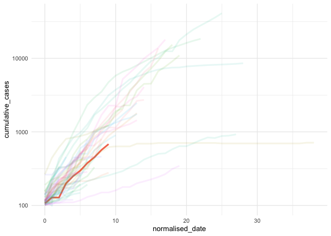

<!-- README.md is generated from README.Rmd. Please edit that file -->

# covidrecon

<!-- badges: start -->

<!-- badges: end -->

R tools for monitoring effectiveness of COVID-19 control efforts

<!-- COVID-19 + RECON suite of tools for outbreak epidemiology + R = COVIDreconoitR -->

COVID-19 + RECON suite of tools for outbreak epidemiology + R =
covidrecon

## Installation

The development version from [GitHub](https://github.com/) with:

``` r
# install.packages("devtools")
devtools::install_github("CBDRH/covidrecon")
```

## Example

``` r
library(covidrecon)
## basic example code
```

``` r
provinces_confirmed_jh <- covid_pull_data()
provinces_confirmed_jh
#> # A tibble: 27,144 x 8
#>    province country_region   lat  long date       cumulative_cases
#>    <chr>    <chr>          <dbl> <dbl> <date>                <dbl>
#>  1 <NA>     Afghanistan       33    65 2020-01-22                0
#>  2 <NA>     Afghanistan       33    65 2020-01-23                0
#>  3 <NA>     Afghanistan       33    65 2020-01-24                0
#>  4 <NA>     Afghanistan       33    65 2020-01-25                0
#>  5 <NA>     Afghanistan       33    65 2020-01-26                0
#>  6 <NA>     Afghanistan       33    65 2020-01-27                0
#>  7 <NA>     Afghanistan       33    65 2020-01-28                0
#>  8 <NA>     Afghanistan       33    65 2020-01-29                0
#>  9 <NA>     Afghanistan       33    65 2020-01-30                0
#> 10 <NA>     Afghanistan       33    65 2020-01-31                0
#> # … with 27,134 more rows, and 2 more variables: incident_cases <dbl>,
#> #   continent <chr>
```

``` r
library(dplyr)
#> 
#> Attaching package: 'dplyr'
#> The following objects are masked from 'package:stats':
#> 
#>     filter, lag
#> The following objects are masked from 'package:base':
#> 
#>     intersect, setdiff, setequal, union
high_incidence_countries <- covid_high_incidence(provinces_confirmed_jh) %>% 
  mutate(alpha = ifelse(country_region == "Australia", 1, 0.7)) %>% 
  filter(normalised_date >= 0)

high_incidence_countries
#> # A tibble: 573 x 9
#>    country_region date       incident_cases cumulative_cases hit_100  rnum
#>    <chr>          <date>              <dbl>            <dbl> <lgl>   <int>
#>  1 Armenia        2020-03-19             31              115 TRUE       58
#>  2 Australia      2020-03-10             16              107 TRUE       49
#>  3 Australia      2020-03-11             21              128 FALSE      50
#>  4 Australia      2020-03-12              0              128 FALSE      51
#>  5 Australia      2020-03-13             72              200 FALSE      52
#>  6 Australia      2020-03-14             50              250 FALSE      53
#>  7 Australia      2020-03-15             47              297 FALSE      54
#>  8 Australia      2020-03-16             80              377 FALSE      55
#>  9 Australia      2020-03-17             75              452 FALSE      56
#> 10 Australia      2020-03-18            116              568 FALSE      57
#> # … with 563 more rows, and 3 more variables: normalised_date <int>,
#> #   continent <chr>, alpha <dbl>
```

``` r
library(ggplot2)
ggplot(data = high_incidence_countries,
         aes(x = normalised_date, 
             y = cumulative_cases,
             colour = country_region)) +
  geom_line(aes(alpha = alpha),
            size = 1.2) +
  scale_y_log10() +
  theme_minimal() +
  theme(legend.position = "none")
```



``` r
library(gghighlight)
selected_countries <- c("China",
                        "Singapore",
                        "Japan",
                        "Iran",
                        "Italy",
                        "Spain",
                        "US",
                        "United Kingdom",
                        "Australia",
                        "France",
                        "Korea, South")

ggplot(data = high_incidence_countries,
         aes(x = normalised_date, 
             y = cumulative_cases,
             colour = country_region)) +
  # geom_line(aes(alpha = alpha), 
  #           size = 1.2) +
  geom_line() + 
   facet_wrap(~ continent, ncol = 2) +
  scale_y_log10() +
  theme_minimal() +
  theme(legend.position = "none") +
  gghighlight(
      country_region %in% c(
        selected_countries
      ),
      label_params = list(size = 2,
                          nudge_y = 10,
                          segment.alpha = 0.2),
      calculate_per_facet = TRUE,
      use_group_by = FALSE
    )
#> label_key: country_region
```


